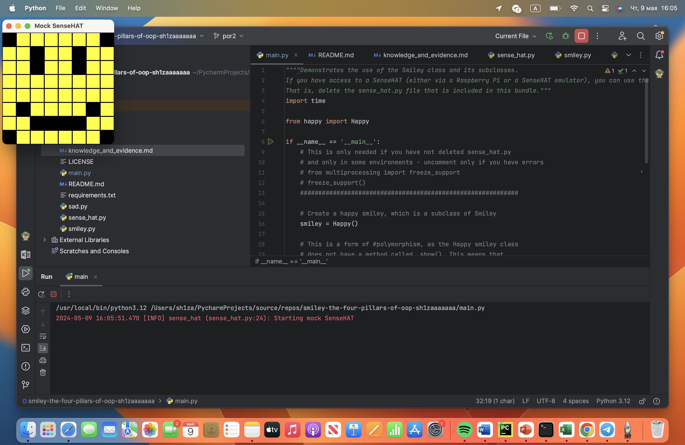
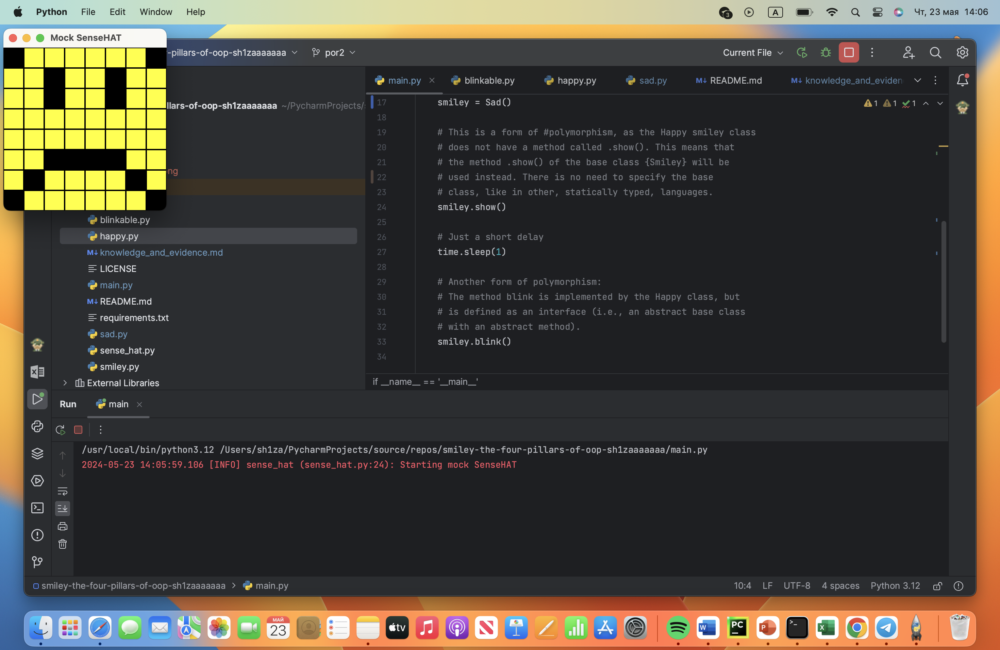
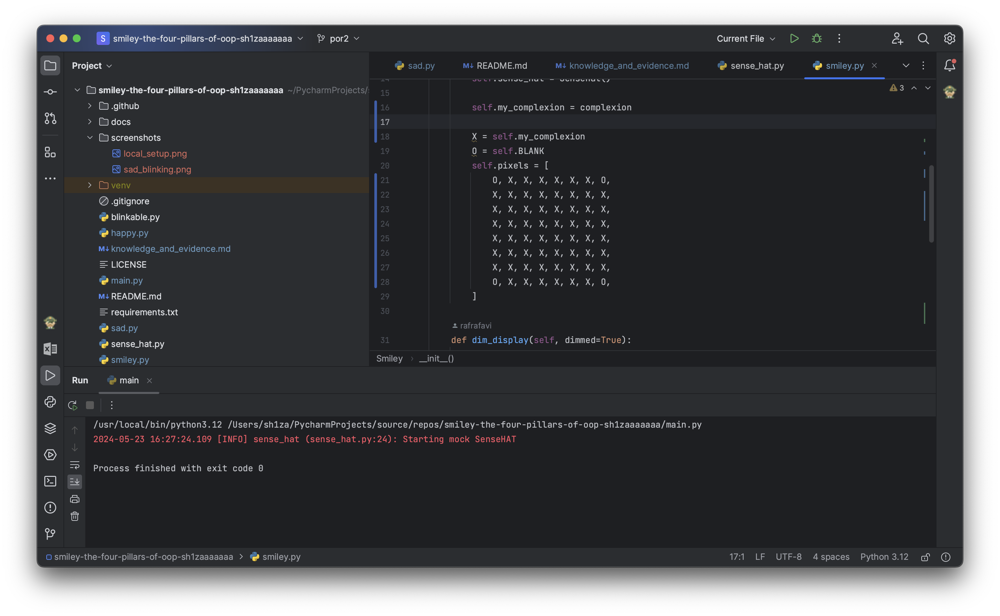

# Evidence and Knowledge

This document provides the structure to evidence your relevant knowledge and skills for this activity.


## Required evidence

### Answer all questions in this document

- Each answer should be complete, well-articulated, and within the specified word count limits (if added) for each question.
- Please make sure all external sources are properly cited.
- You must use your own words. If you use generative AI in any capacity, you must include your full chat transcripts.

### Make all the required modifications to the code

- Please follow the instructions in this document to make the necessary changes to the code.

- When requested to upload evidence, upload all screenshots to `screenshots/` and embed them in this document. For example:

```markdown

```

- You must upload the code into this GitHub repository.
- While you can use a branch, your code should be in main when you submit.
- Upload a zip of this repository to Blackboard when you are ready to submit.
- Feedback will be provided via GitHub, but you will be notified of your result via Blackboard

### Use of Raspberry Pi and SenseHat

The use of Raspberry Pi and SenseHat is optional for this activity. You can use the included ` sense_hat.py` file to simulate the SenseHat on your computer.

If you use a PI, please **delete** the `sense_hat.py` file.

### Accessible version of the code

This project relies on visual patterns that appear on an LED matrix. If you have any accessibility requirements, you can use the `udl/accessible` branch to complete the project. This branch provides an accessible code version that uses text-based patterns instead of visual ones.

Please discuss this with your lecturer before using that branch.

## Specific Tasks & Questions

Address the following tasks and questions based on the code provided in this repository.

### Set up the project locally

1. Clone this repository
2. Run the project locally by executing the `main.py` file
3. Evidence this by providing screenshots of the project directory structure and the output of the `main.py` file


If you are running on a Raspberry Pi, you can use the following command to run the project and then screenshot the result:

```bash
ls
python3 main.py
```

### Identifying and understanding classes

> Note: Ignore the `sense_hat.py` file when answering the questions below

1. List all the classes you identified in the project. Indicate which classes are base classes and which are subclasses. For subclasses, identify all direct base classes. Use the following table for your answers:

| Class Name | Super or Sub? | Direct parent(s)     |
|------------|---------------|----------------------|
| Smiley     | Super         | -                    |
| Happy      | Sub           | Smiley<br/>Blinkable |
| Sad        | Sub           | Smiley               |
| Blinkable  | Sub           | ABC                  |

...

2. Explain the concept of 'abstraction' as demonstrated in this project. (Max 150 words)

> Abstraction is one of the fundamental OOP principle that allow developers to define interfaces with abstract methods without providing concrete information.
> 
> This allows subclasses like Happy to inherit from Blinkable and provide their own implementation of the blink method according to their specific requirements.

3. What is the name of the process of deriving from base classes? What is its purpose in this project? (Max 150 words)

> This process called inheritance, and it allows to inherit attributes and methods from another class.
> 
> In this project, inheritance serves several purposes:
>   1. Code re-usability: classes "Happy" and "Sad" inherit common attributes and methods from "Smiley" that leads to reducing code duplication.
>   2. Polymorphism: "Happy" inherits from both "Smiley" and "Blinkable" allowing it to provide specific implementations for abstract method "blink" by using inherited method "show".

### Compare and contrast classes

Compare and contrast the classes Happy and Sad.

1. What is a key difference between the two classes?
   > The key difference is that in "Sad" class we are not using abstract method "blink" yet
     and obviously did not override it. However, there is a minor difference in pixels that we select to draw a mouth by method "draw_mouth". 
2. What are the key similarities?
   > 1. They both inherits from "Smiley" class.
   > 2. They both override "draw_mouth" and "draw_eyes" methods.
3. What difference stands out the most to you and why?
   > That at this version of code happy Smiley could blink while sad one couldn't.
     Because we didn't override "blink" method for "Sad" class.
4. How do these differences affect the functionality of these classes
   > In general, it doesn't affect at the functionality of the code, ofcourse if we don't want sad Smiley to blink. 

### Where is the Sense(Hat) in the code?

1. Which class(s) utilize the functionality of the SenseHat?
   > SenseHat class defined as "sense_hat.py" utilizes functionality of the SenseHat
2. Which of these classes directly interact with the SenseHat functionalities?
   > The Smiley class directly interact with SenseHat class by initializing a SenseHat object.
3. Discuss the hiding of the SenseHAT in terms of encapsulation (100-200 Words)
   > In this project, the SenseHat object is encapsulated within the "Smiley" class.
   > The "Smiley" class manages the SenseHat instance and interacts with it through its own methods.
   > For example, methods "show" and "dim_display" are provided by the "Smiley" class to interact with the SenseHat's functionalities.

### Sad Smileys Can’t Blink (Or Can They?)

Unlike the `Happy` smiley, the current implementation of the `Sad` smiley does not possess the ability to blink. Let's first explore how blinking has been implemented in the Happy smiley by examining the blink() method, which takes one argument that determines the duration of the blink.

1. **Understanding Blink Mechanism:** In your own words, explain how the `blink()` method enables the Happy smiley to blink. What role does the argument play in this method?

> It enables Happy Smiley to blink by temporary changing the state of the smiley's eyes and then restoring it.
> By passing argument to this method you can choose for how long you want Smiley's eyes remain closed.

2. **Implement Blink in Sad Class:**

   - Create a new method called `blink` within the Sad class. Ensure you use the same method signature as in the Happy class:

   ```python
   def blink(self, delay=0.25):
       pass  # Replace 'pass' with your implementation
   ```

3. **Code Implementation:** Implement the code that allows the Sad smiley to blink. Use the implementation from the Happy smiley as a reference. Ensure your new method functions similarly by controlling the blink duration through the `delay` argument.

4. **Testing the Implementation:**

- Test the new blink functionality on your Raspberry Pi or within the Python classes provided. You might need to adjust the `main.py` script to incorporate the Sad Smiley's new blinking capability.

Include a screenshot of the sad smiley or the modified `main.py`:



- Observe and document the Sad smiley as it blinks its eyes. Describe any adjustments or issues encountered during implementation.

  > Libraries such as "time" were not imported to "sad" class as well as "blinkable" class.
  > Also, "sad" class was not imported into main

  ### If It Walks Like a Duck…

  Previously, you implemented the blink functionality for the Sad smiley without utilizing the class `Blinkable`. Assuming you did not use `Blinkable` (even if you actually did), consider how the Sad smiley could blink in a similar manner to the Happy smiley without this specific class.

  1. **Class Type Analysis:** What kind of class is `Blinkable`? Inspect its superclass for clues about its classification.

     >  "blinkable" is an abstract base class, meaning it is intended to be a blueprint for other classes. It can't be instantiated on its own and must be subclassed.
  2. **Class Implementation:** `Blinkable` is a class intended to be implemented by other classes. What generic term describes this kind of class, which is designed for implementation by others? **Clue**: Notice the lack of any concrete implementation and the naming convention.

  > Interface

  3. **OO Principle Identification:** Referring to your answer in question (2), which Object-Oriented (OO) principle does this represent? Choose from the following and justify your answer in 1-2 sentences: Abstraction, Polymorphism, Inheritance, Encapsulation.

  > Polymorphism

  4. **Implementation Flexibility:** Explain why you were able to grant the Sad Smiley a blinking feature similar to the Happy Smiley's implementation, even without directly using `Blinkable`.

  > Python's class system allows you to the class without it needing to explicitly declare that it implements another class,  as long as the required methods are correctly defined.

  5. **Concept and Language Specificity:** In relation to your response to question (4), what is this capability known as, and why is it feasible in Python and many other dynamically typed languages but not in most statically typed programming languages like C#? **Clue** This concept is hinted at in the title of this section.

  > Duck Typing

  ***

  ## Refactoring

  ### Does a Smiley Have to Be Yellow?

  While our current implementation predominantly features yellow smileys, emotional expressions like sickness or anger typically utilize colors like green, red, or orange. We'll explore the feasibility of integrating these colors into our smileys.

  1. **Defined Colors and Their Location:**

     1. Which colors are defined and in which class(s)?
        > White, Green, Yellow and Black (Which is described as Blank) defined in "Smiley" class.
     2. What type of variables hold these colors? Are the values expected to change during the program's execution? Explain your answer.
        > Tuples of three integers. They are constant (at least there is no methods to change them during the program run), so they won't change.
     3. Add the color blue to the appropriate class using the appropriate format and values.

  2. **Usage of Color Variables:**

     1. In which classes are the color variables used?
        > "Smiley", "Sad" and "Happy".

  3. **Simple Method to Change Colors:**
  4. What is the easiest way you can think to change the smileys to green? Easiest, not necessarily the best!
     > Since the color variables are defined as class attributes, we can simply reassign them to the "GREEN" color value.

  Here's a revised version of the "Flexible Colors – Step 1" section for the smiley project, incorporating your specifications for formatting and content updates:

  ### Flexible Colors – Step 1

  Changing the color of the smileys once is straightforward, but it isn't very flexible. To facilitate various colors for smileys, it is advisable not to hardcode values in any class. This approach was identified earlier as a necessary change. Let's start by removing the built-in assumptions about color in our classes.

  1. **Add a method called `complexion` to the `Smiley` class:** Implement this instance method to return `self.YELLOW`. Using the term "complexion" instead of "color" provides a more abstract terminology that focuses on the meaning rather than implementation.

  2. **Refactor subclasses to use the `complexion` method:** Modify any subclass that directly accesses the color variable to instead utilize the new `complexion` method. This ensures that color handling is centralized and can be easily modified in the future.

  3. **Determine the applicable Object-Oriented principle:** Consider whether Abstraction, Polymorphism, Inheritance, or Encapsulation best applies to the modifications made in this step.

  4. **Verify the implementation:** Ensure that the modifications function as expected. The smileys should still display in yellow, confirming that the new method correctly replaces the direct color references.

  This step is crucial for setting up a more flexible system for color management in the smiley display logic, allowing for easy adjustments and extensions in the future.

  ### Flexible Colors – Step 2

  Having removed the hardcoded color values, we now enhance the base class to support dynamic color assignments more effectively.

  1. **Modify the `__init__()` method in the `Smiley` class:** Introduce a default argument named `complexion` and assign `YELLOW` as its default value. This allows the instantiation of smileys with customizable colors.

  2. **Introduce a new instance variable:** Create a variable called `my_complexion` and assign the `complexion` parameter to it. This step ensures that each smiley instance can maintain its own color state.

  3. **Rationale for `my_complexion`:** Using a distinct instance variable like `my_complexion` avoids potential conflicts with the method parameter names and clarifies that it is an attribute specific to the object.

  4. **Bulk rename:** We want to update our grid to use the value of complexion, but we have so many `Y`'s in the grid. Use your IDE's refactor tool to rename all instances of the **symbol** `Y` to `X`. Where `X` is the value of the `complexion` variable. Include a screenshot evidencing you have found the correct refactor tool and the changes made.

  

  5. **Update the `complexion` method:** Adjust this method to return `self.my_complexion`, ensuring that whatever color is assigned during instantiation is what the smiley displays.

  6. **Verification:** Run the updated code to confirm that Smileys still defaults to yellow unless specified otherwise.

  ### Flexible Colors – Step 3

  With the foundational changes in place, it's now possible to implement varied smiley colors for different emotional expressions.

  1. **Adjust the `Sad` class initialization:** In the `Sad` class's initializer method, change the superclass call to include the `complexion` argument with the value `self.BLUE`, as shown:

     ```python
     super().__init__(complexion=self.BLUE)
     ```

  2. **Test color functionality for the Sad smiley:** Execute the program to verify that the Sad smiley now appears blue.

  3. **Ensure the Happy smiley remains yellow:** Confirm that changes to the Sad smiley do not affect the default color of the Happy smiley, which should still display in yellow.

  4. **Design and Implement An Angry Smiley:** Create an Angry smiley class that inherits from the `Smiley` class. Set the color of the Angry smiley to red by passing `self.RED` as the `complexion` argument in the superclass call.

  ***
